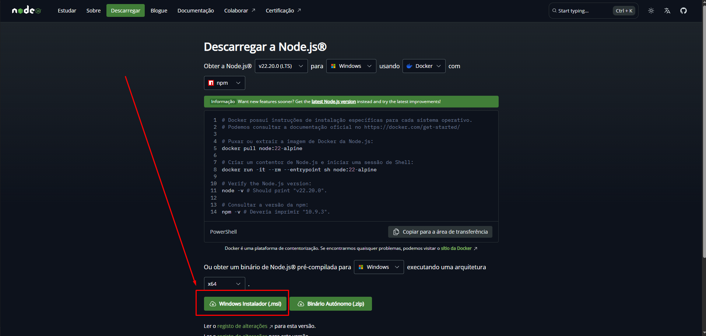
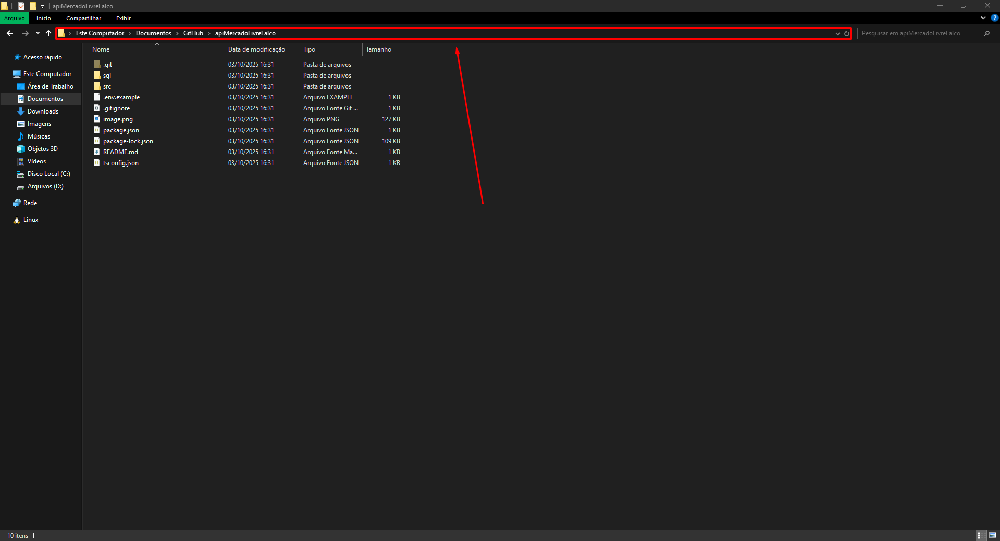
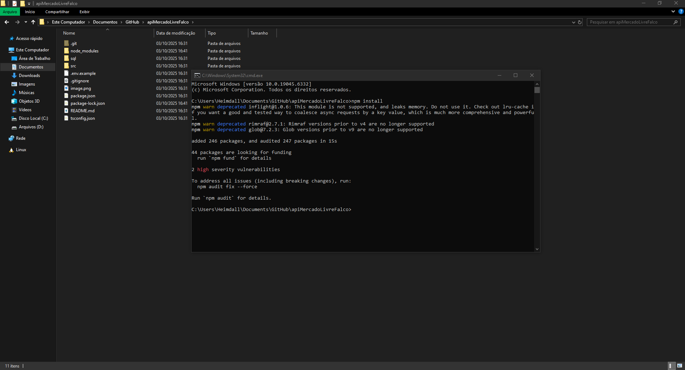

# Como rodar a API no cliente
## Instalando as ferramentas necessárias
1. Para rodar o projeto devemos primeiro instalar o Node.js (Versão 22 ou acima) caso a máquina ainda não possua. [Acesse o link de download do Node.js](https://nodejs.org/pt/download)



2. Clone / Copie o projeto para alguma pasta

3. Dentro da pasta do projeto, clique na barra de endereço em uma área vazia



4. Digite `cmd` e dê **Enter**. Isso abrirá o terminal já no caminho certo do projeto.

5. No terminal, digite o comando `npm install` e aguarde. Quando o comando for finalizado, você verá que uma nova pasta chamada "node_modules foi criada"



6. Ainda no terminal, execute o comando `npm install pm2 -g`

7. Agora precisamos compilar nosso projeto. Para isso, digite o comando `npx tsc`. Isso criará uma pasta chamada "compilado"

## Configuração
1. Copie o arquivo ".env.example" para dentro da pasta "compilado" e renomeie para ".env"

2. Insira o valor das variáveis de acordo com o seu ambiente
```sh
CLIENT_ID=your_client_id                  // CLIENT_ID do Mercado Livre
CLIENT_SECRET=your_key                    // CLIENT_SECRET do Mercado Livre
REDIRECT_URI=https://your_url/callback    // Url completa apontando para rota de callback, Ex. https://falcotestes.loca.lt

NFE_PATH=./notas-xml                      // Caminho onde as notas xml vão ser armazenadas

DATABASE_SERVER=localhost                 // Servidor do banco de dados
DATABASE_USER=sa                          // Usuário do banco de dados
DATABASE_PASSWORD=admin                   // Senha do banco de dados
DATABASE_NAME=database                    // Base de dados
```

3. Entre na pasta "compilado" pelo terminal. Você pode fazer isso repetindo o passo 3 da etapa anterior

4. Execute o comando `pm2 start server.js --name ml-api-falco` para rodar a API

5. Para verificar se a api está sendo executada, insira o comando `pm2 list` e verifique se o item aparece com o nome "ml-api-falco" e com o status "online"

## Contas dos vendedores
Para que a sincronização ocorra é necessário que a conta de vendas do Mercado Livre faça login na API
1. Com a API rodando, entre em localhost:3000/login. Você será redirecionado para o Mercado Livre para fazer o login
2. Faça o login, se tudo der certo você será redirecionado para outra página escrito "Ok"

## Atualizando API
Quando uma nova versão estiver disponível, basta puxá-la utilizando o fetch e pull do Git, compilar e reiniciar o serviço com pm2

1. Pare o serviço pm2 com o comando `pm2 stop ml-api-falco`
2. Compile com o comando dentro da pasta raiz do projeto com o comando `tsc`
3. Dentro da pasta compilado, execute o serviço com o comando `pm2 start ml-api-falco`

## Vendedor
```json
{
  "id": 2676136618,
  "email": "test_user_1085532379@testuser.com",
  "nickname": "TESTUSER1085532379",
  "site_status": "active",
  "password": "jd8RhKjP1C"
}
```

## Comprador
```json
{
  "id": 2676436804,
  "email": "test_user_349109307@testuser.com",
  "nickname": "TESTUSER349109307",
  "site_status": "active",
  "password": "6JKEQL9Fvh"
}
```