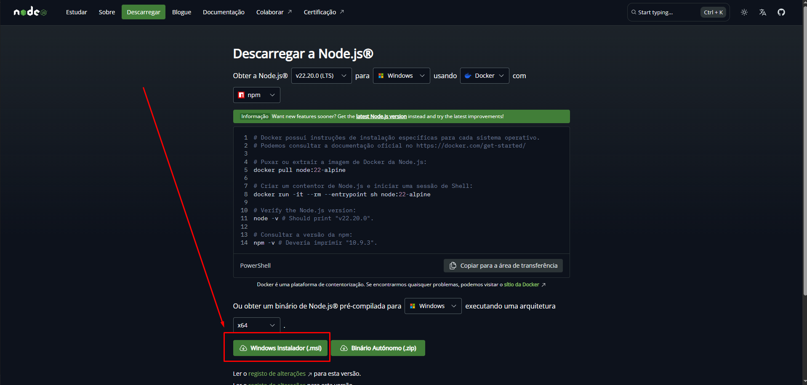

# Rodar o projeto no cliente
1. Para rodar o projeto devemos primeiro instalar o Node.js (Versão 22 ou acima) caso a máquina ainda não possua. [Acesse o link de download do Node.js](https://nodejs.org/pt/download)




## Vendedor
```json
{
  "id": 2676136618,
  "email": "test_user_1085532379@testuser.com",
  "nickname": "TESTUSER1085532379",
  "site_status": "active",
  "password": "jd8RhKjP1C"
}
```

## Comprador
```json
{
  "id": 2676436804,
  "email": "test_user_349109307@testuser.com",
  "nickname": "TESTUSER349109307",
  "site_status": "active",
  "password": "6JKEQL9Fvh"
}
```